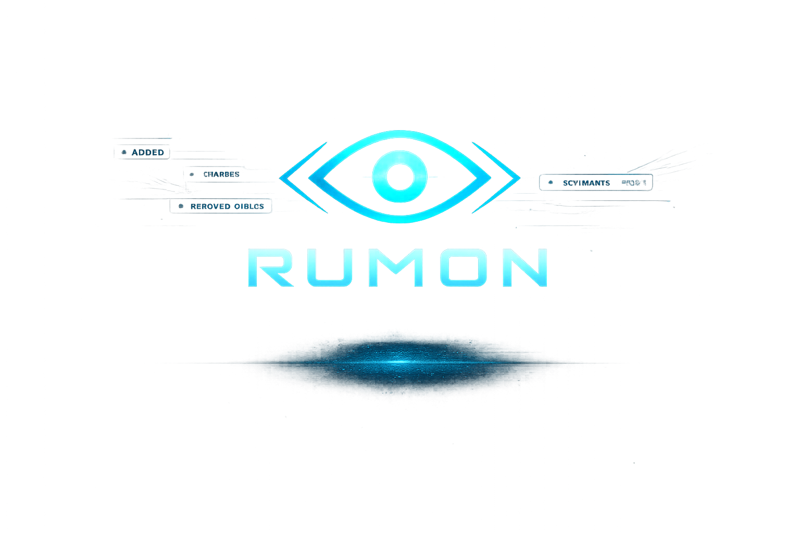

<p align="center">
  
</p>

<h1 align="center">Rumon</h1>

<p align="center">
  Modern File Monitor
</p>

<p align="center">
  Watch • Diff • React
</p>

<p align="center">
  <a href="https://rumon-eight.vercel.app">Documentation</a> •
  <a href="#">Installation</a> •
  <a href="#">Examples</a> •
  <a href="#">Roadmap</a>
</p>

<p align="center">
  
</p>

# Rumon

Rumon is a modern file monitor for developers. It watches your project, shows what changed, restarts your command, renders a polished terminal UI, and can run automation hooks for specific file events.


## Features

- Native file watching with debounce and rename detection.
- Ratatui terminal dashboard with Changes and Logs panels.
- Git-style diff previews powered by `similar`.
- File, folder, metadata, content, and permission events.
- Rule-based `[[event_hooks]]` with glob paths and `when` expressions.
- Profiles for Rust, Node, Go, Python, and Docker workflows.
- JSON, NDJSON, HTTP, SSE, WebSocket, IPC, and remote monitor integrations.

## Install

### Quick install (latest)

Linux/macOS:

```bash
curl -fsSL https://raw.githubusercontent.com/duongonix/rumon/master/scripts/install.sh | sh
```

Windows (PowerShell):

```powershell
iwr -useb https://raw.githubusercontent.com/duongonix/rumon/master/scripts/install.ps1 | iex
```

### Install specific version

Linux/macOS:

```bash
curl -fsSL https://raw.githubusercontent.com/duongonix/rumon/master/scripts/install.sh | sh -s -- v0.1.0
```

Windows (PowerShell):

```powershell
& ([scriptblock]::Create((iwr -useb https://raw.githubusercontent.com/duongonix/rumon/master/scripts/install.ps1))) -Version v0.1.0
```

Verify:

```bash
rumon --version
```

## Quick Start

Create a config:

```bash
rumon init
```

Run Rumon:

```bash
rumon
```

Run a command directly:

```bash
rumon -w src -- cargo run
```

Use plain output instead of the TUI:

```bash
rumon --no-tui -- cargo run
```

## Example Config

```toml
version = 1
profile = "rust"

[watch]
paths = ["src", "crates", "rumon.toml"]
ignore = [".git", "target", "node_modules", "dist"]
debounce_ms = 500

[run]
cmd = "cargo run"
restart = true

[[event_hooks]]
name = "rust check"
events = ["file_created", "file_modified", "file_deleted", "file_renamed"]
paths = ["src/**/*.rs", "crates/**/*.rs"]
when = 'file.ext == "rs"'
cmd = "cargo check --workspace"
```

## Commands

```bash
rumon init
rumon tui
rumon watch --json --once
rumon watch --ndjson
rumon server --host 127.0.0.1 --port 3717
rumon daemon --ipc
rumon remote agent --addr 127.0.0.1:4040 --node laptop-a --token secret
rumon remote connect --addr 127.0.0.1:4040 --node local --token secret
```

## Development

```bash
cargo fmt --all
cargo check --workspace
cargo test --workspace
```

Build release binary:

```bash
cargo build --release -p rumon-cli
```

## Documentation

Docs live in `rumon/` as an Astro Starlight site:

```bash
cd rumon
npm run dev
```
